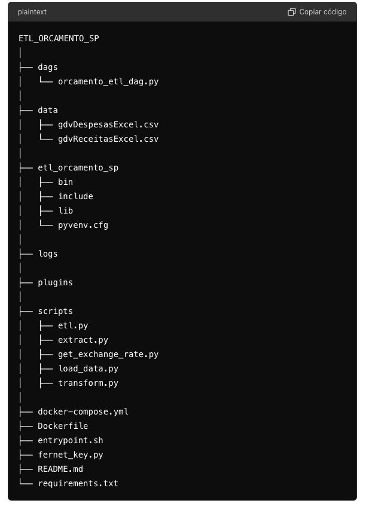

# ETL Orçamento SP

Este projeto consiste em desenvolver um pipeline ETL para processar os dados do orçamento do Estado de São Paulo de 2022, convertendo valores dolarizados para reais e armazenando-os em um formato adequado para responder às perguntas de negócio.


## Estrutura do Projeto




## Ferramentas

- Docker
- Docker Compose
- Git
- Airflow
- Python
- SQL


## Instruções de configuração local

**1. Clone o repositório para a sua máquina local:**

```bash
git clone https://github.com/lariguim/etl_orcamento_sp.git
cd etl_orcamento_sp


```

**2. Configurar o ambiente virtual:**

```bash
python -m venv etl_orcamento_sp
source etl_orcamento_sp/bin/activate
pip install -r requirements.txt


```

**3. Configurar o Docker compose**

```bash
      AIRFLOW__CORE__FERNET_KEY: 'fernet_key'
    


```

**4. Você pode gerar uma chave Fernet utilizando o script fernet_key.py:**

```bash
  python scripts/fernet_key.py

```

**5. Iniciar os serviços**

```bash
docker-compose up -d


```


**6. Configurar Airflow**

Acesse a interface web do Airflow em http://localhost:8080 e configure a conexão com o PostgreSQL:

- airflow_user: admin
- airflow_password: admin

**Conexao PostgreSQL**

- Connection ID: postgres_default
- Conn Type: Postgres
- Host: postgres
- Schema: orcamento_sp
- Login: larissa
- Password: larissa
- Port: 5432
Acesse a interface web do Airflow em http://localhost:8080 e ative a DAG orcamento_etl_dag


## Executando a DAG
Acesse a interface do Airflow em http://localhost:8080, ative a DAG orcamento_etl_dag e execute-a manualmente para iniciar o processo ETL


## Scripts em ordem de execução: 

- extract.py: Contém funções para extração de dados de despesas e receitas.

- get_exchange_rate.py: Contém funções para obter a taxa de câmbio no dia 22/06/2022.

- transform.py: Contém funções para a transformação de dados de despesas e receitas.

- load_data.py: Contem funçoes que criam conexoes com o banco PostgreSQL, e carregam os dados transformados em uma tabela final chamada orcamento.

- etl.py: script principal do pipeline.


## Premissas de Negócio

- Transformações realizadas:
  - Remoção dos pontos (.) dos números para garantir que sejam interpretados corretamente como números float.
  - Substituição da vírgula (.) por ponto (.) para garantir a correta formatação numérica.
  - Conversão dos valores para tipo numérico usando `pd.to_numeric`, com a opção `errors='coerce'` para lidar com valores inválidos.
  - Filtragem de valores nulos e zeros, considerando que fontes de recurso sem liquidação e sem arrecadação não são relevantes em análises.
  - Remoção de linhas onde a Fonte de Recurso está ausente.

- Pontos Importantes:
  - Ambas as funções de transformação (`transform_despesas` e `transform_receitas`) são projetadas para lidar com erros de formatação nos valores numéricos, como pontos e vírgulas.
  - Após as transformações, os DataFrames resultantes (`df_despesas_transform` e `df_receitas_transform`) são utilizados para inserir os dados no banco de dados ou para outros fins de análise ou processamento.


## Tabela final

| ID Fonte Recurso  | Nome Fonte Recurso | Total Liquidado | Total Arrecadado |
| ------------- | ------------- | ------------- | ------------- |
| 001  | TESOURO-DOT.INICIAL E CRED.SUPLEMENTAR  | 9999.99 | 9999.99 |


## Dicionário 

- ID Fonte Recurso: Código da fonte de recurso segundo arquivo fonte
- Nome da Fonte de Recurso: Nome da Fonte de Recurso segundo arquivo fonte
- Total Liquidado: Valor da liquidação da despesa em Real
- Total Arrecadado: Valor da arrecadação da receita em real


## Questões de Negócio

Uma vez que os dados estejam carregados na tabela, você pode utilizar as seguintes consultas SQL para responder às perguntas:

**1. Quais são as 5 fontes de recursos que mais arrecadaram?**

```sql
select id_fonte_recurso, nome_fonte_recurso, total_arrecadado 
from orcamento
order by total_arrecadado DESC
limit 5;
```
- 001	TESOURO-DOT.INICIAL E CRED.SUPLEMENTAR
- 006	OUTRAS FONTES DE RECURSOS
- 005	RECURSOS VINCULADOS FEDERAIS
- 082	RECURSOS VINCULADOS ESTADUAIS-INTRA
- 007	OP.CRED.E CONTRIB.DO EXTERIOR-DOT.INIC.CR.SU


**2. Quais são as 5 fontes de recursos que mais gastaram?**

```sql
select id_fonte_recurso, nome_fonte_recurso, total_liquidado
from orcamento
order by total_liquidado DESC
limit 5;
```

- 041	TESOURO - CREDITO POR SUPERAVIT FINANCEIRO
- 082	RECURSOS VINCULADOS ESTADUAIS-INTRA
- 006	OUTRAS FONTES DE RECURSOS
- 005	RECURSOS VINCULADOS FEDERAIS
- 047	REC.OPERAC. DE CREDITO-P/SUPERAVIT FINANCEIR


**3. Quais são as 5 fontes de recursos com a melhor margem bruta?**

```sql
SELECT id_fonte_recurso, nome_fonte_recurso, total_liquidado, total_arrecadado
FROM orcamento ORDER BY (total_arrecadado - total_liquidado) DESC LIMIT 5;

```
- 001	TESOURO-DOT.INICIAL E CRED.SUPLEMENTAR
- 006	OUTRAS FONTES DE RECURSOS
- 005	RECURSOS VINCULADOS FEDERAIS
- 086	OUTRAS FONTES DE RECURSOS-INTRA
- 007	OP.CRED.E CONTRIB.DO EXTERIOR-DOT.INIC.CR.SU


**4. Quais são as 5 fontes de recursos que menos arrecadaram?**

```sql
SELECT id_fonte_recurso, nome_fonte_recurso, total_arrecadado
FROM orcamento ORDER BY total_arrecadado ASC
LIMIT 5;
```

- 041	TESOURO - CREDITO POR SUPERAVIT FINANCEIRO
- 045	REC.VINC.TRANSF.FEDERAL/SUPERAVIT FINANC.
- 044	REC.PROP.ADM.IND-CRED.P/SUPERVAVIT FINANCEIR
- 042	REC.VINC.ESTADUAIS-CRED.SUPERAVIT FINANCEIRO
- 004	REC.PROPRIO-ADM.IND.-DOT.INIC.CR.SUPL.


**5.Quais são as 5 fontes de recursos que menos gastaram?**

```sql
SELECT id_fonte_recurso, nome_fonte_recurso, total_liquidado
FROM orcamento ORDER BY total_liquidado ASC
LIMIT 5;
```
- 043	F.E.D - CREDITO POR SUPERAVIT FINANCEIRO
- 084	REC.PROPRIO-ADM.IND.-DOT.INIC.CR.SUPL.-INTRA
- 083	RECURSOS VINCULADOS-FUNDO ESP. DESPESA-INTRA
- 044	REC.PROP.ADM.IND-CRED.P/SUPERVAVIT FINANCEIR
- 002	RECURSOS VINCULADOS ESTADUAIS


**6. Quais são as 5 fontes de recursos com a pior margem bruta?**

```sql
SELECT id_fonte_recurso, nome_fonte_recurso, total_arrecadado, total_liquidado
FROM orcamento ORDER BY (total_arrecadado - total_liquidado) ASC
LIMIT 5;

```
- 043	F.E.D - CREDITO POR SUPERAVIT FINANCEIRO
- 084	REC.PROPRIO-ADM.IND.-DOT.INIC.CR.SUPL.-INTRA
- 083	RECURSOS VINCULADOS-FUNDO ESP. DESPESA-INTRA
- 044	REC.PROP.ADM.IND-CRED.P/SUPERVAVIT FINANCEIR
- 002	RECURSOS VINCULADOS ESTADUAIS


**7. Qual a média de arrecadação por fonte de recurso?**

```sql
  SELECT AVG(total_arrecadado) FROM orcamento;

```

1.394.670.977,53


**8. Qual a média de gastos por fonte de recurso?**

```sql
SELECT AVG(total_liquidado) FROM orcamento;

```
222.860.257,96


## Observações

O projeto foi salvo em um banco PostgreSQL por ser uma versao gratuita de banco de dados. Não utilizei o BigQuery conforme preferencia devido a falta de recursos para acessar a Cloud. 


## Documentação

- [Docker](https://docs.docker.com/manuals/)
- [Airflow](https://airflow.apache.org/docs/)


## Próximos Passos


Essa projeto foi dividido em ciclos e essa entrega corresponde ao ciclo 1 do projeto, a primeira versao do nosso pipeline de etl para orçamentos do estado de SP. O ciclo 1 tem, tem o objetivo de estruturar uma entrega rápida pensado estratégicamente para munir o negócio de informações.
Sendo assim, com essa versão, já é possível extrair algumas informações úteis para nortear as decisões de negócio. 

Para dar continuidade ao projeto, entraremos no **ciclo 2, 3 e 4**, que contemplam as melhorias listadas abaixo:

**Teste Unitario:** 
- Escrever testes unitários para os scripts extract.py, get_exchange_rate.py, transform.py e load_data.py usando unittest ou pytest.

**Melhoria do Pipeline:**
- Implementar logs detalhados nos scripts para monitorar o progresso e diagnosticar problemas.
- Configurar monitoramento e alertas no Airflow para notificações em caso de falhas no pipeline.


**Automatização e CI/CD**
- CI/CD: Configurar um pipeline de CI/CD usando GitHub Actions, Jenkins, ou outra ferramenta de CI/CD para automatizar testes e implantações.

**Melhoria de Desempenho**
- Otimização de Consultas: Revisar e otimizar as consultas SQL para melhorar o desempenho.
- Escalabilidade: Verificar a escalabilidade do pipeline, especialmente se o volume de dados aumentar.

**Deploy em Produção**
- BigQuery: Finalizar a integração com o BigQuery e testar a carga de dados em produção.
- Segurança: Implementar práticas de segurança, como o gerenciamento adequado de segredos e variáveis de ambiente.

**Feedback e Iteração**
- Feedback: Obter feedback do time sobre os resultados e possíveis melhorias.
- Iteração: Iterar sobre o pipeline com base no feedback, adicionando novas features ou melhorando as existentes.

**Escalonamento**
- Novas Fontes de Dados: Adicionar novas fontes de dados se necessário.
- Manutenção Contínua: Estabelecer um plano de manutenção contínua para monitorar e atualizar o pipeline conforme necessário.
